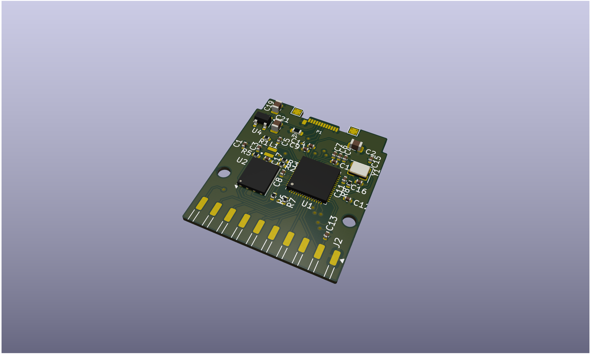

# rp2350-gpio-card
Expansion Card circuit based on RP2350 for Framework mainboards providing GPIO to the computer. Circuit is based on [Expansion Card template](https://github.com/FrameworkComputer/ExpansionCards) and [RP2350A Minimal board](https://datasheets.raspberrypi.com/rp2350/hardware-design-with-rp2350.pdf).

# License
Designed by: [Tan Siret Akıncı](https://github.com/tansiret).
Schematics and footprint are licensed with [CC BY 4.0](LICENSE).
