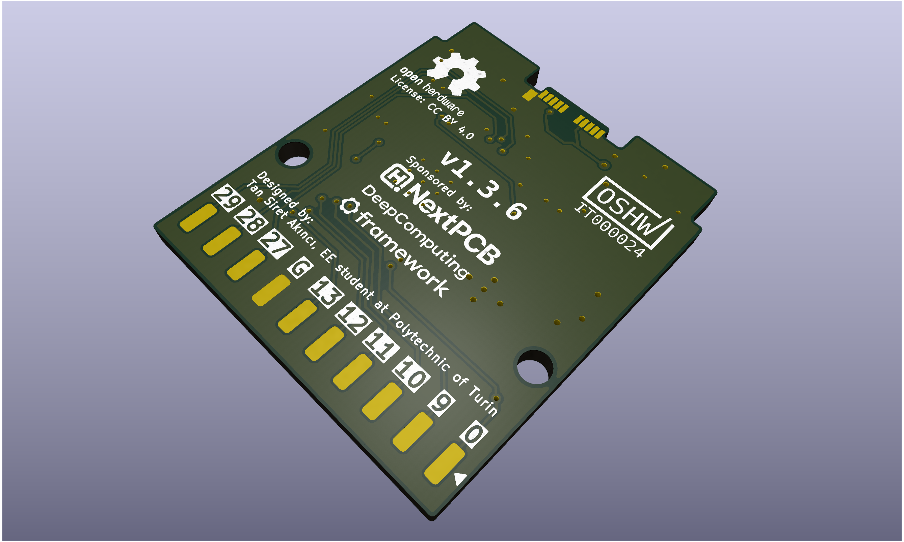

# rp2350-gpio-card
Expansion Card circuit based on RP2350 for Framework mainboards providing GPIO to the computer. Circuit is based on [Expansion Card template](https://github.com/FrameworkComputer/ExpansionCards) and [RP2350A Minimal board](https://datasheets.raspberrypi.com/rp2350/hardware-design-with-rp2350.pdf). Designed in [KiCad](https://www.kicad.org/).

# GPIO
### Front
| Label | Name   | SPI       | UART       | I2C        | ADC |
| :---- | :----- | :-------- | :--------- | :--------- | :-- |
| 0     | GPIO0  | SPI0 RX   | UART0 TX   | I2C0 SDA   |     |
| 1     | GPIO1  | SPI0 CSn  | UART0 RX   | I2C0 SCL   |     |
| 2     | GPIO2  | SPI0 SCK  |            | I2C1 SDA   |     |
| 3     | GPIO3  | SPI0 TX   |            | I2C1 SCL   |     |
| 4     | GPIO4  | SPI0 RX   | UART1 TX   | I2C0 SDA   |     |
| 5     | GPIO5  | SPI0 CSn  | UART1 RX   | I2C0 SCL   |     |
| 6     | GPIO6  | SPI0 SCK  |            | I2C1 SDA   |     |
| 7     | GPIO7  | SPI0 TX   |            | I2C1 SCL   |     |
| VCC   | 3.3v   |           |            |            |     |
| R     | Reset  |           |            |            |     |

### Back
| Label | Name   | SPI       | UART       | I2C        | ADC   |
| :---- | :----- | :-------- | :--------- | :--------- | :---- |
| 29    | GPIO29 |           |            |            | ADC3  |
| 28    | GPIO28 |           |            |            | ADC2  |
| 27    | GPIO27 |           |            | I2C1 SDL   | ADC1  |
| G     | Ground |           |            |            |       |
| 13    | GPIO13 | SPI1 CSN  | UART0 RX   | I2C0 SCL   |       |
| 12    | GPIO12 | SPI1 RX   | UART0 TX   | I2C0 SDA   |       |
| 11    | GPIO11 | SPI1 TX   |            | I2C1 SCL   |       |
| 10    | GPIO10 | SPI1 SCK  |            | I2C1 SDA   |       |
| 9     | GPIO9  | SPI1 CSn  | UART1 RX   | I2C0 SCL   |       |
| B     | Boot   |           |            |            |       |

# License
Designed by: [Tan Siret Akıncı](https://github.com/tansiret).
Schematics and footprint are licensed with [CC BY 4.0](LICENSE).
Politecnico di Torino name used in this project is © 2025 Politecnico di Torino.
The project has been certified by OSHW as Open Source Hardware (UID: [IT000024](https://certification.oshwa.org/it000024.html)).
 

